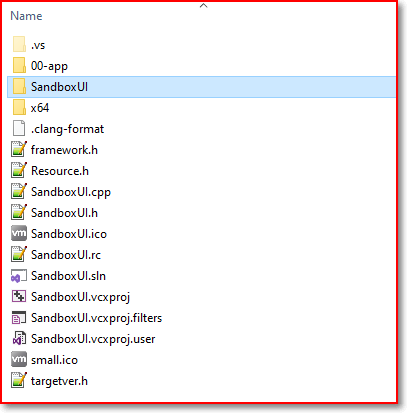
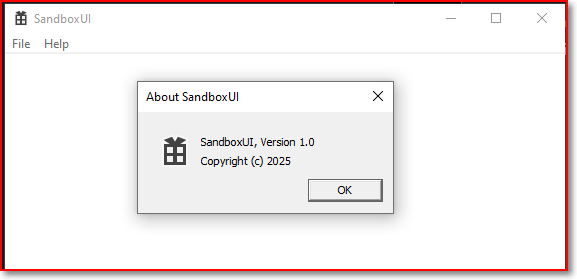

# How to create a new `windows desktop application` project?

## Step1:

## Step2:

## Step3:
You get a 'C:\SandboxUI' with these contents:

## Step4:
If you hit the green triangle 'run' button

## That's all.

