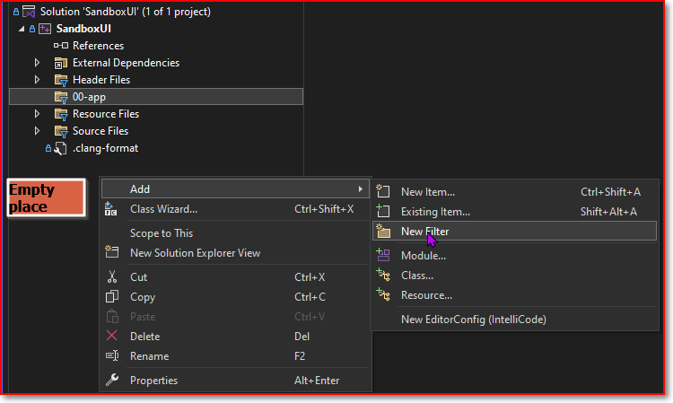
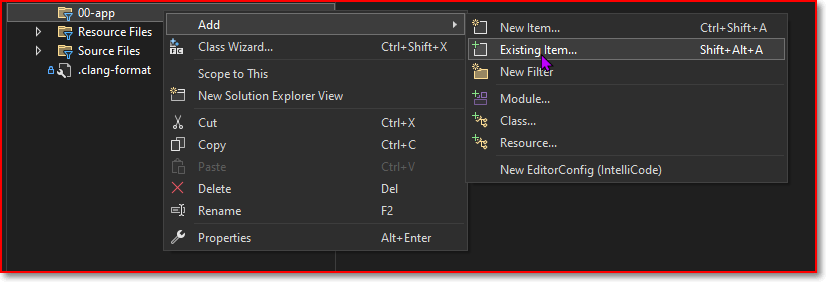
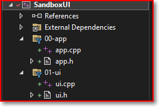

# Organize the Solution Windows

## 1. Add a new folder (called `filter`)




## 2. Use VScode to add files and folders

1. add files and folders in vscode in VsCode
2. add filters in VisualStudio
3. add the files to the filters







## 3. Use code snippets (a VSCode Extension) to add fill a file with a tab key

Put this content in the global snippet template, 
Then when you type 'cfile' plus a 'tab' key, the content is copied to the file automatically.

```json
{
	// Place your snippets for cpp here. Each snippet is defined under a snippet name and has a prefix, body and 
	// description. The prefix is what is used to trigger the snippet and the body will be expanded and inserted. Possible variables are:
	// $1, $2 for tab stops, $0 for the final cursor position, and ${1:label}, ${2:another} for placeholders. Placeholders with the 
	// same ids are connected.
	// Example:
	// "Print to console": {
	// 	"prefix": "log",
	// 	"body": [
	// 		"console.log('$1');",
	// 		"$2"
	// 	],
	// 	"description": "Log output to console"
	// }
    // https://code.visualstudio.com/docs/editing/userdefinedsnippets 


"new a .c file": {
    "prefix": "cfile",
    "body": [
"/**",
"******************************************************************************",
"* @file    ${TM_FILENAME}",
"* @author  ARTHUR",
"* @version V1",
"* @date    ${CURRENT_YEAR}-${CURRENT_MONTH}-${CURRENT_DATE} ${CURRENT_HOUR}:${CURRENT_MINUTE}:${CURRENT_SECOND}",
"* @brief   $1",
"*",
"*",                    
"******************************************************************************",
"* @attention",
"*",
"*",
"******************************************************************************",
"*/",
"",
"/*******************************************************************************",
"************************************ Includes **********************************",
"*******************************************************************************/",
"",
"#include $0",
"",
"/*******************************************************************************",
"******************************** Private typedef *******************************",
"*******************************************************************************/",
"",
"/*******************************************************************************",
"******************************** Private define ********************************",
"*******************************************************************************/",
"",
"/*******************************************************************************",
"********************************* Private macro ********************************",
"*******************************************************************************/",
"",
"/*******************************************************************************",
"******************************* Private variables ******************************",
"*******************************************************************************/",
"",
"/*******************************************************************************",
"************************** Private function prototypes *************************",
"*******************************************************************************/",
"",
"/*******************************************************************************",
"******************************* Private functions ******************************",
"*******************************************************************************/",
"",
"",
"/*******************************************************************************",
"******************************* Public Variables *******************************",
"*******************************************************************************/",
"",
"/*******************************************************************************",
"******************************* Public functions *******************************",
"*******************************************************************************/",
"",
"",
"/********************************* end of file ********************************/",
"",
"",
		],
		"description": "Arthur's own c/cpp template"
},


"new .h file": {
	"prefix": "hfile",
	"body": [


"/**",
"********************************************************************************",
"* @file    ${TM_FILENAME}",
"* @author  Arthur",
"* @version V1.0",
"* @date    ${CURRENT_YEAR}-${CURRENT_MONTH}-${CURRENT_DATE} ${CURRENT_HOUR}:${CURRENT_MINUTE}:${CURRENT_SECOND}",
"* @brief   Public functions and datatypes from this function",
"*",
"*  ",                    
"********************************************************************************",
"* @attention",
"*",
"*",
"********************************************************************************",
"*/",
"/*******************************************************************************",
"********************* Define to prevent recursive inclusion ********************",
"*******************************************************************************/",
"#ifndef __${TM_FILENAME_BASE/(.*)/${1:/upcase}/}_H",
"#define __${TM_FILENAME_BASE/(.*)/${1:/upcase}/}_H",
"/*******************************************************************************",
"************************************ Includes **********************************",
"*******************************************************************************/",
"//#include $0",
"",
"/*******************************************************************************",
"********************************* Exported macro *******************************",
"*******************************************************************************/",
"",
"/*******************************************************************************",
"********************************* Exported types *******************************",
"*******************************************************************************/",
"",
"/*******************************************************************************",
"******************************* Exported constants *****************************",
"*******************************************************************************/",
"",
"/*******************************************************************************",
"*************************** Exported global variables **************************",
"*******************************************************************************/",
"",
"/*******************************************************************************",
"******************************* Exported functions *****************************",
"*******************************************************************************/",
"",
"",
"",
"#endif /* __${TM_FILENAME_BASE/(.*)/${1:/upcase}/}_H */",
"/********************************* end of file ********************************/",
"",
"",


	],
	"description": "Arthru's .h file template"
},


"function template": {
  "prefix": "function",
  "body": [
"/*******************************************************************************",
"* @brief  xxxx ",
"* @param  xxxx",
"* @retval xxxx",
"* @details ${CURRENT_YEAR}-${CURRENT_MONTH}-${CURRENT_DATE} ${CURRENT_HOUR}:${CURRENT_MINUTE}:${CURRENT_SECOND}: ",
"*******************************************************************************/",
"void $1(void){",
"",
"}",
"",   
  ],
  "description": "Arthur function template"
}


}

```