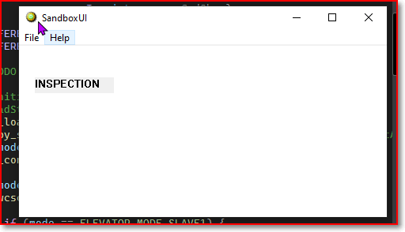
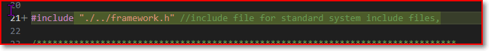
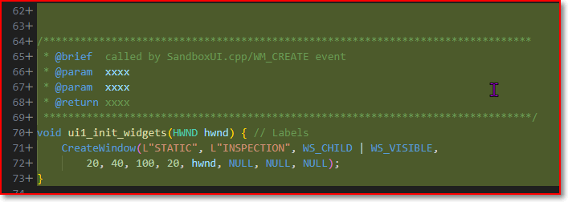
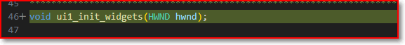
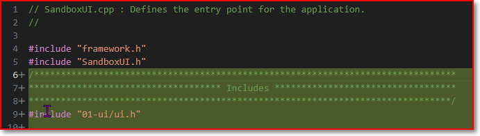
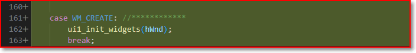

# Add a Label

Key takeway: 
1. How it works? in the ui.c/h module, make a function and call `CreateWindow` to create the label. Main.cpp call this function in WM_CREATE event once. 
2. **Everything** on the screen is a '**Windows**'
## 1. Outcome

## 2. Code changes

### 1 In ui module

to use `HWND` type.

Declaration in .h file

### 2 In the main

