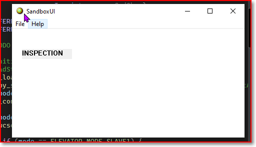
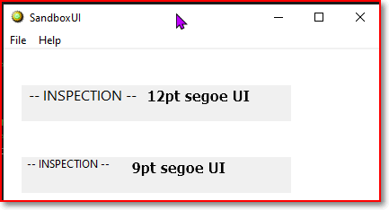
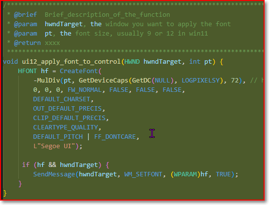
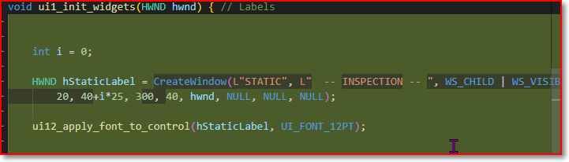

# Change Fonts

Key takeaway:
1. How it works? you create a font and sent message to the control, in win32 there is no way to change the default font type, we have to sent the font changing message to every control.
2. (The label is a window control)
3. (Everything in win32 is a windows)

## Before

## After 

## Code change

