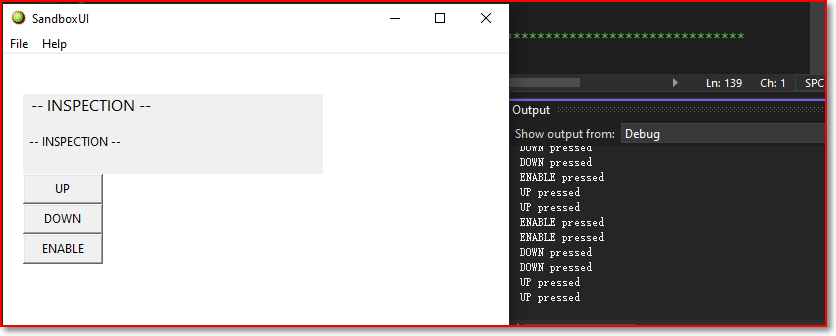
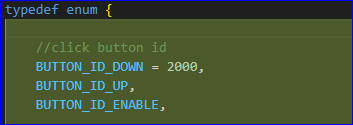
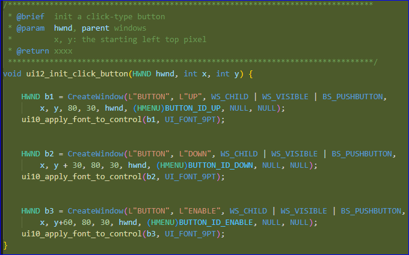
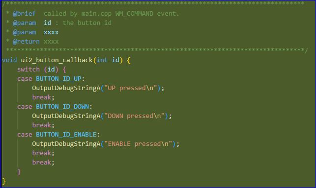
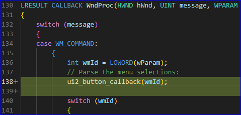

# Add click-type button

A click-type button is the default button type, it generate a 'WM_COMMAND' event when you lift the click.

This demo output a message when a button is click, the output window is in Debug/View/Output menu.

## Code Change
1. define the button IDs for each button (used for callback)

2. called by SandboxUI.cpp/WM_CREATE event, the button window control is created

3. create a button callback function
   

4. Call the callback in WM_COMMAND event. 

---- The end
