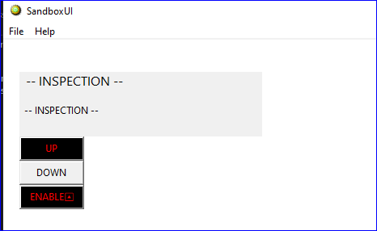
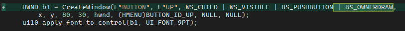
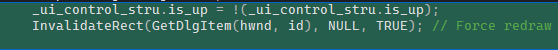
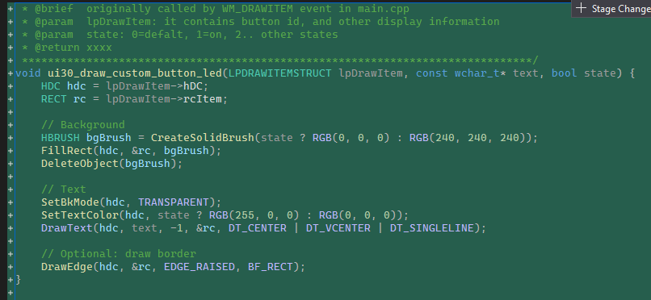

# Use a button as a LED
Key takeaway:
1. This solution redraw the button (background, text, border), use custom button (with `BS_OWNERDRAW` when creating it)
2. start point is Invalidate(), it will trigger the `WM_DRAWITEM` event, in the event, you draw the box and text. 

## Code implementation

1. create the button, with ownerdraw, that means it's custom button.

2. trigger the redraw, here we have a bool data to track the state (clicked or not), because win32 don't remember anything.

3. in the WM_DRAWITEM event, you manually draw the background, border, and text youself.

# End

