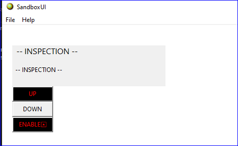
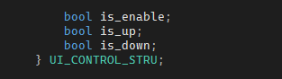
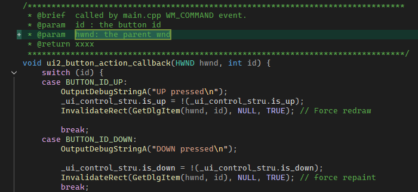
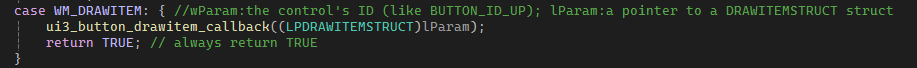
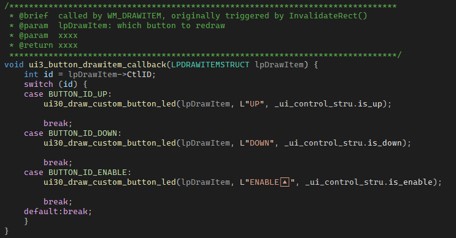

# 2-Pos Button / Switch

The default button is 'click-type', this 'click-lock' type remember the button on-off state through your software (the is_enable data in UI local data), It shows the switch/lock state by changing the button color.

## Code Change

1. you need to maintain the switch state in ui:

2. when the button is clicked (as a normal button click), you track the state change. use a switch operator when you have more buttons, and in each 'case', you call invalidate() to trigger the redraw event.

3. in the redraw event, draw the button according to the state

# The end

