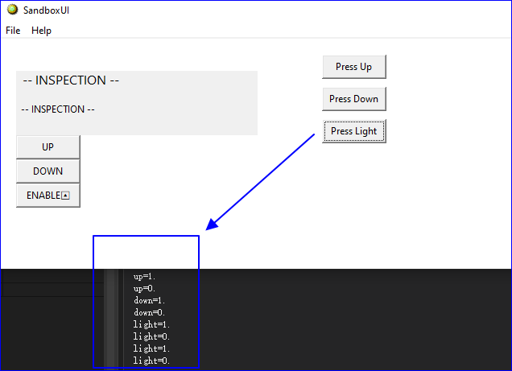
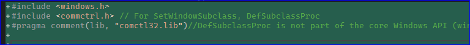
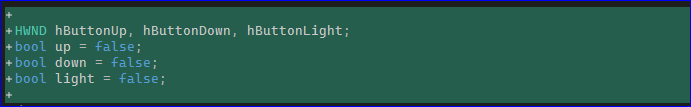
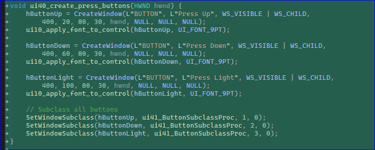
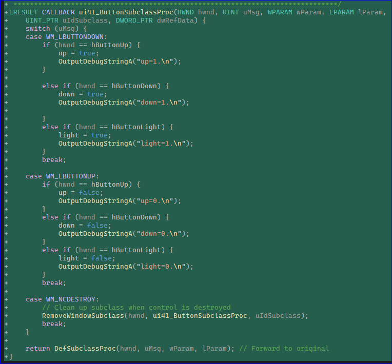
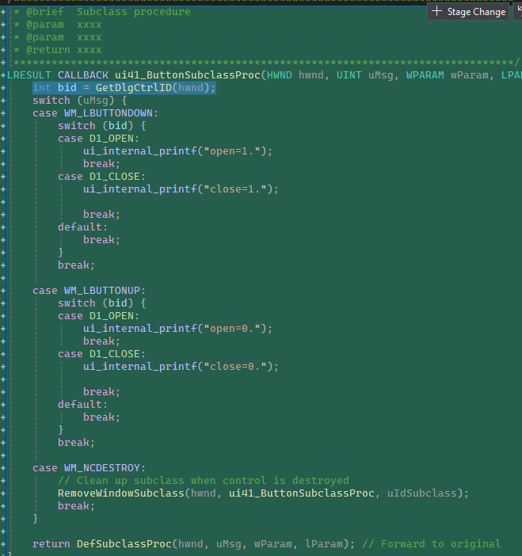

# Continuous-press type button
This type of button is used:  
To detect both button press and release events (like bool up = 1 on press and up = 0 on release),

> I initially used this 'SetWindowSubclass' solutioin, which is said to be safer and compatiable across all windows OSes. 

## Code Change (all code is in ui.cpp)

1. Include the library

2. Create buttons and keep their HWNDs

You need to track the state of the press buttons, win31 does NOT do this for you.

3. Create the callback, this can sit anywhere in your project, to make it simple, just put it in ui.cpp

or using the button id (prefered solution) to identify between buttons.

# end

