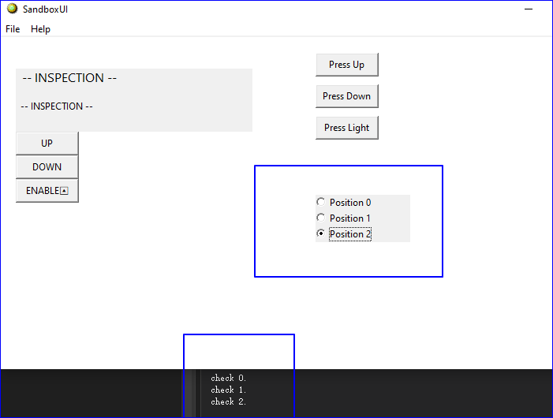
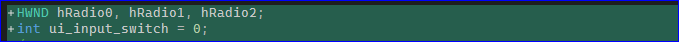
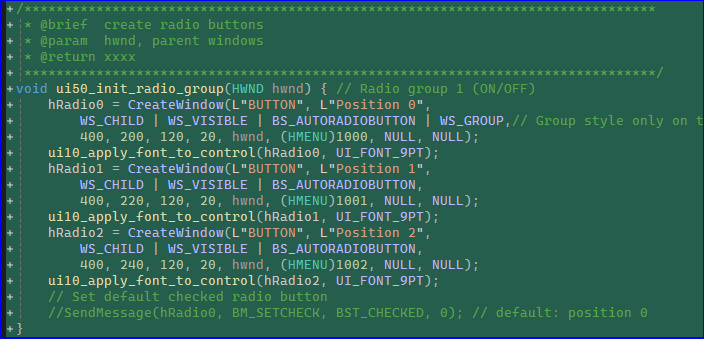
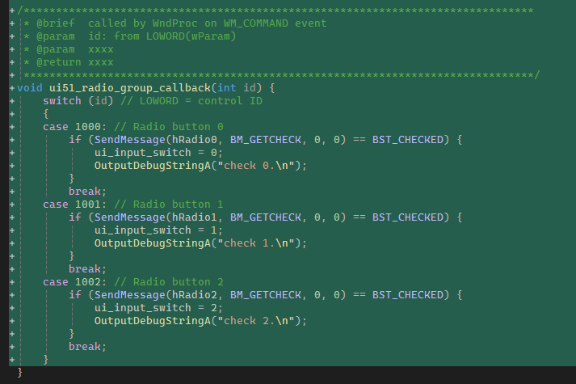
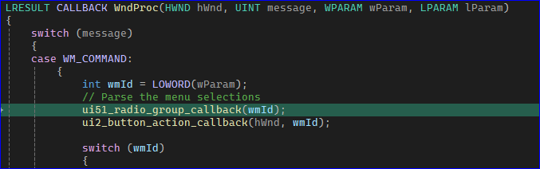

# Radio-Group input type

1. Win32 GDI only does half of the job. For a radio-group type, you need to track 3 individual checkboxes. 

## Code Change (in both ui.cpp and main.cpp)

1. track the radio buttons

2. create radio buttons, they are automatically grouped after first `BS_GROUP` tag. You don't need to manually uncheck the others — BS_AUTORADIOBUTTON does that.

3. the call back function track the state of `ui_input_switch`.
   

# End

