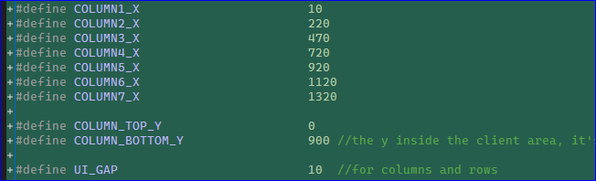

# How I set top-level layout

 

## Draft Design

Use drawio to finish the primative layout design first.

1. Divide the window into several smaller blocks, I prefer several columns.
2. Decide placing what widgets into each block
3. get each block's (x,y,w,h) --- from the 'arrange' sidebar

## Code Change

1. set windows size, this is the outer size, a little larger than client area size.

 

2. set the block basic size, here I use 'columns' as blocks

3. set each block's (x,y,w,h)

4. in ui.cpp, draw all the lables with block (x,y,w,h) settings

# END

