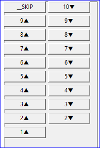
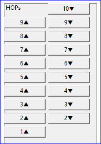
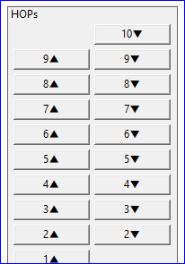
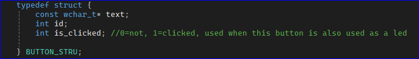
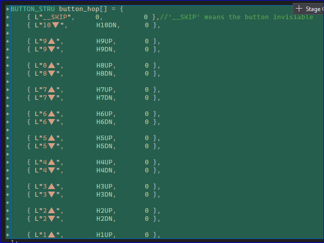
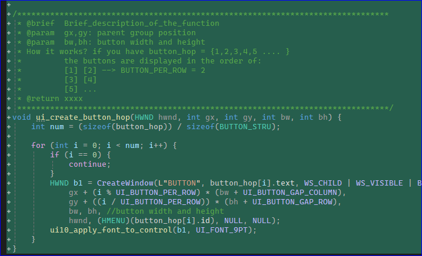

# Button Matrix

|start from (0,0) in the group | make 1st invisable | offset (x,y) to display better |
|:--|:--|:--|
||  | |

## Code Change

1. Define the data behind the button matrix: name, id, clicked status.

2. Create all the buttons in a matrix use `for()` loop. use `continue` to skip some specific buttons, leaving a blank in the place.

# END
