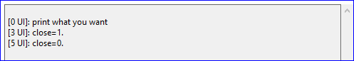
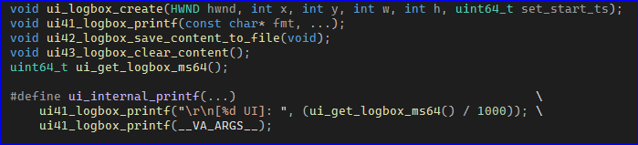
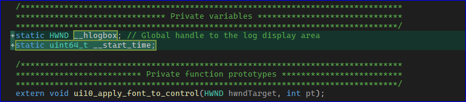
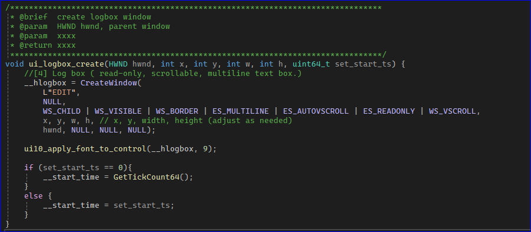
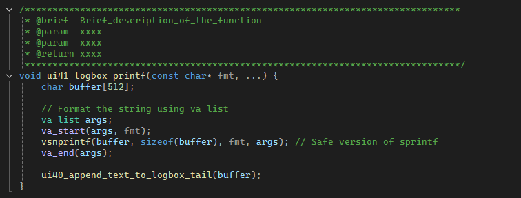
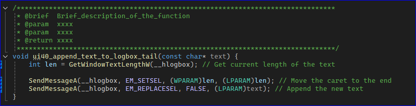
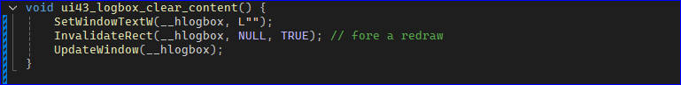
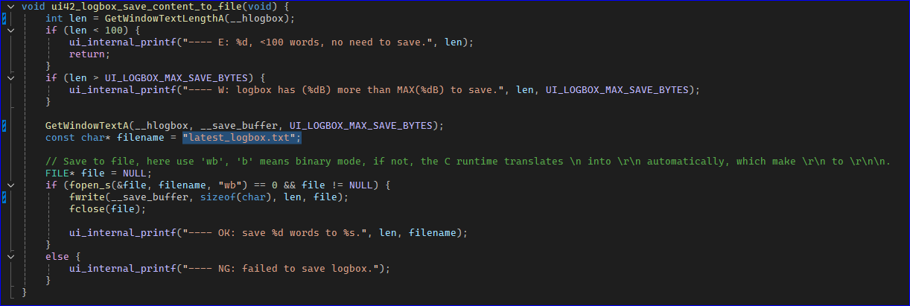

# Logbox Module

In the .h file, after calling `ui_logbox_create()`,  you can use either `ui41_logbox_printf()`, which add NO extra characters to your string passed to it; or use `ui_internal_printf()`, which will add timestamp and an extra `\r\n` for you. 

## Code Change

1. use two local variable, the `__start_time` stores the ms ts when application boots up.

2. it's created as an editable window. the `__start_time` can be passd from ui.cpp or by itself.

3. the most used function is 'printf', this function format the string and send message to logbox wedget.

4. you can assign a button to clear the history of the logbox.

5. you can also assign a butto to save the content of the logbox into a file. the file name is defined in the function.

# END