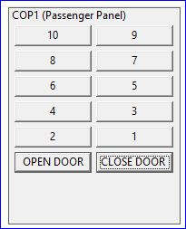
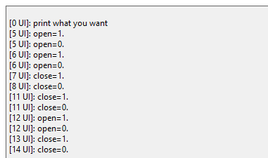
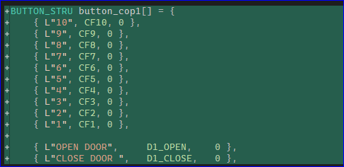
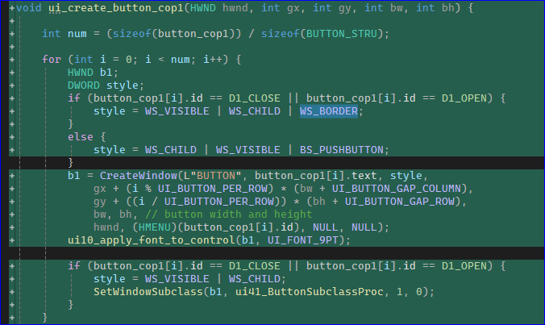
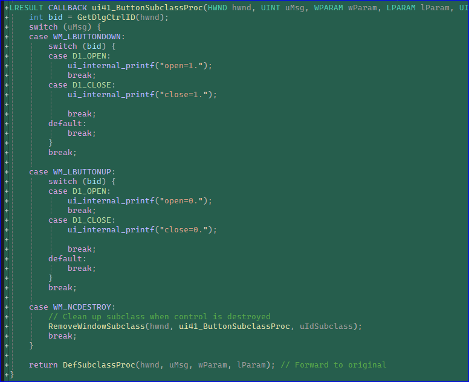

# COP panel: matrix buttons with two continuous-press type

## Code Change

1. define the data for the button matrix

2. create the buttons, use an if...else... to deal with two types of buttons. 

3. assign callback to continuous-press type buttons, (two share the same call back)

# end