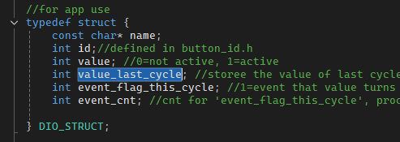
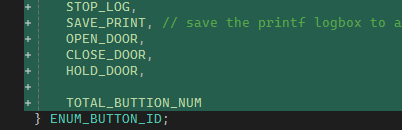
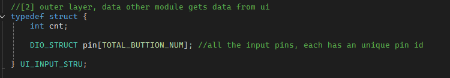
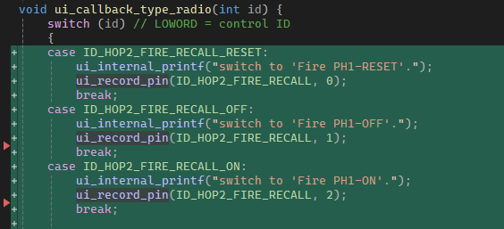
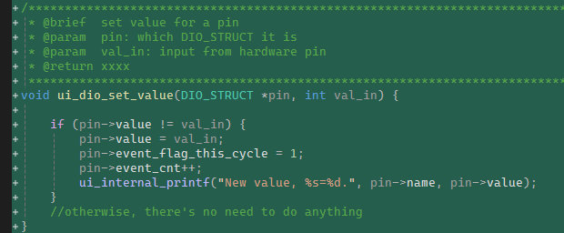
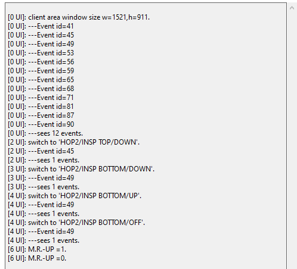
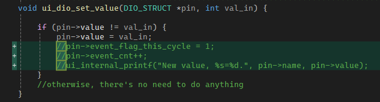
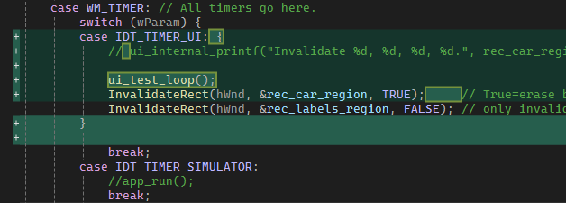
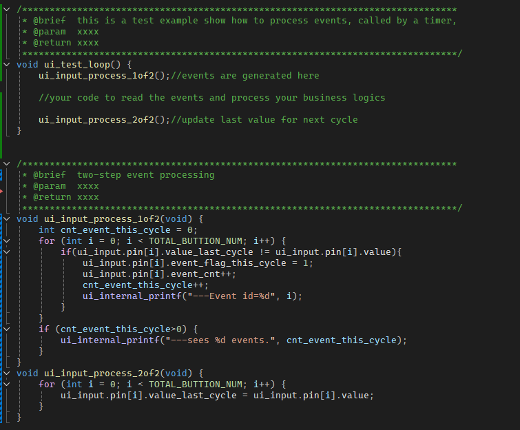

# How UI module works as Input?

## Code Changes

1. key datatype is `DIO_STRUCT`

2. Make an array and assign each input an unique ID

`UI_INPUT_STRU ui_input;`

3. In the hardware pin interrupt callback, update the array.

This example shows a 3-position radio group, which is assigned with 4 IDs: it has 3 physical pins, but uses a logical 4th ID as the data to UI upper level. 

A macro function is used to record pin status to dio_stru array.

`#define ui_record_pin(ID, level) ui_dio_set_value(&(ui_input.pin[ID]), level);`

> Note here, the `value_last` is not used. The reason is that, this module actively read the pin status, instead of passively. Then, it could be deleted.

## In most case, we're using a thread to generate the events.

If we have only one type of IO, we can adopt the method above. However, in most case, to sync with io task, the IOs are read and copied periodically. Let me explain here more.

1. We modify the read_pin() function so that in the interrupts, hardware writes realtime level status to the pin array.

2. We set a timer to call and process ui inputs.

3. This time, we need to use the last_value member, because the pin is written by interrupts asynchronously.
   
 

# END
