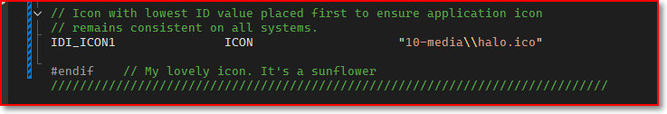

# Change Icon

How to change icon in the title bar, taskbar and the application exe icon. 

Key takeaway:
1. the icon id is defined in the .rc file, the code use the id to display the icon on the title bar and taskbar
2. when compiling, the first icon file in .rc is selected as the .exe icon.

## step1. add the .ico to .rc
1. place the .ico anywhere you like, say here "project directory/10-media/halo.ico"


## step2. let the .rc file know which .ico you want to use.

There are two ways:
1. you add your new ico, modify the code in cpp to load the new add one
2. you add your new ico, only modify the .rc to replace old the old one

### (option1) Add your resource to the .rc file 


You get:



1. the `hIcon` is the taskbar icon
2. the `hIconSm` is the Title bar icon (small one)


### (option2) Replace the .rc setting

I recommend this way, it's simple. 


## step3. Rebuild and run it.
When you build the project, the icon is embeded into the executable. 

>Windows picks the **first** ICON resource in the compiled .res as the default application (EXE) icon.


Those 3 icons changes as demand. 


That's it.


<br>


## Extra food

Change icons at runtime.


```c

#include <windows.h>
#include "resource.h"   // contains IDI_APP_ICON

void SetAppIcon(HWND hwnd, HINSTANCE hInstance, int iconID)
{
    // Load big and small icons from resource
    HICON hIconBig = (HICON)LoadImage(hInstance,
                                      MAKEINTRESOURCE(iconID),
                                      IMAGE_ICON,
                                      GetSystemMetrics(SM_CXICON),
                                      GetSystemMetrics(SM_CYICON),
                                      LR_DEFAULTCOLOR);

    HICON hIconSmall = (HICON)LoadImage(hInstance,
                                        MAKEINTRESOURCE(iconID),
                                        IMAGE_ICON,
                                        GetSystemMetrics(SM_CXSMICON),
                                        GetSystemMetrics(SM_CYSMICON),
                                        LR_DEFAULTCOLOR);

    // Apply to the window
    SendMessage(hwnd, WM_SETICON, ICON_BIG,   (LPARAM)hIconBig);
    SendMessage(hwnd, WM_SETICON, ICON_SMALL, (LPARAM)hIconSmall);
}


//
HWND hwnd = CreateWindowEx(...);
SetAppIcon(hwnd, hInstance, IDI_APP_ICON);

```